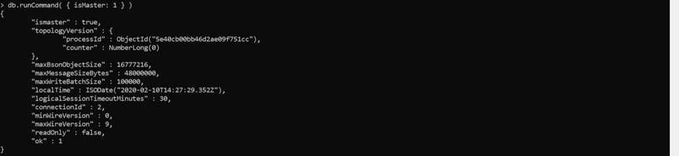
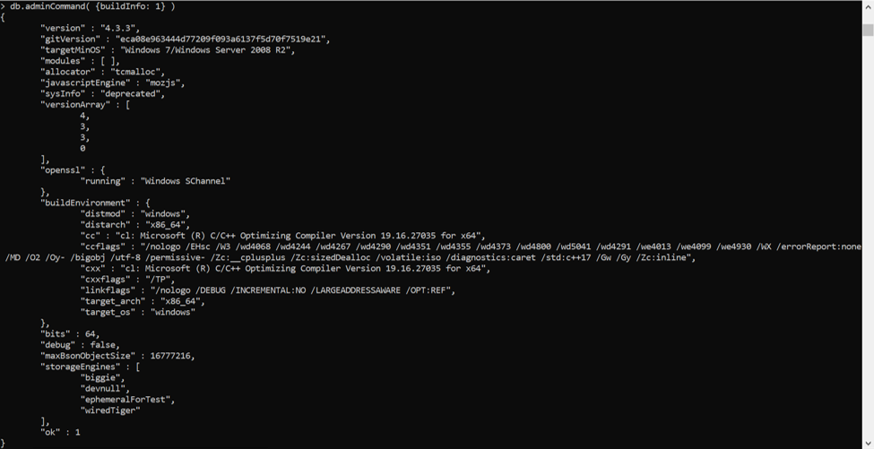
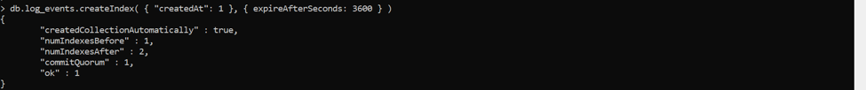
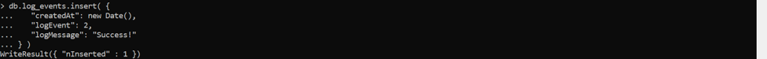
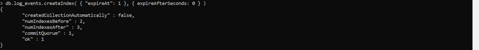
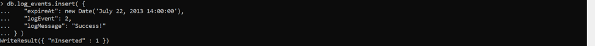
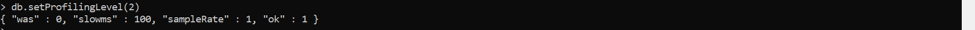
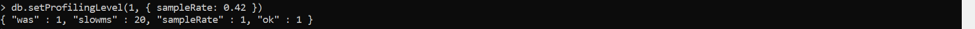

# tekn-basis-data
# TUGAS
# UAS

1. Use Database Commands/Formulir Perintah Basis Data - isMaster merupakan pengembalikan dokumen yang menjelaskan peran instance mongod. Jika mongod adalah anggota dari set replika , maka ismaster dan bidang secondary melaporkan jika instance adalah primer atau jika itu adalah anggota sekunder dari set replika.
Shell mongo menyediakan metode pembantu untuk menjalankan perintah yang disebut db.runCommand(). Operasi berikut di mongo menjalankan perintah dengan memberikan bantuan untuk menjalankan perintah basis data tertentu. Ini adalah metode yang disukai untuk mengeluarkan perintah basis data, karena menyediakan antarmuka yang konsisten antara shell dan driver.
db.runCommand() menjalankan perintah dalam konteks database saat ini. Beberapa perintah hanya berlaku dalam konteks basis data admin, dan Anda harus mengubah objek db Anda sebelum menjalankan perintah ini atau menggunakan db.adminCommand() .
seperti pada gambar 

 Database admin yang mana pengguna harus memiliki akses ke database admin untuk menjalankan perintah administratif tertentu. Untuk daftar perintah administrative.
 Namun, ada juga perintah yang secara otomatis menjalankan perintah dalam konteks database admin : seperti pada gambar 

 2. Recover a Standalone after an Unexpected Shutdown/Pulihkan Standalone setelah Shutdown Tidak Terduga - Buat salinan cadangan dari file data di --dbpath . - Mulai mongod dengan --repair. Untuk memperbaiki file data, mulai instance mongod dengan opsi --repair.

 3. Expire Data from Collections by Setting TTL/Kedaluwarsa Data dari Koleksi dengan Mengatur TTL - Kedaluwarsa Dokumen setelah Jumlah Detik yang Ditentukan Untuk kedaluwarsa data setelah sejumlah detik tertentu berlalu sejak bidang yang diindeks, buat indeks TTL pada bidang yang menyimpan nilai tipe tanggal BSON atau larik objek bertipe tanggal BSON dan tentukan nilai non-nol positif di expireAfterSeconds bidang. Dokumen akan kedaluwarsa ketika jumlah detik di bidang expireAfterSeconds telah berlalu sejak waktu yang ditentukan dalam bidang yang diindeks. [1] Misalnya, operasi berikut ini membuat indeks pada bidang log_events koleksi createdAt dan menentukan nilai expireAfterSeconds dari 3600 untuk menetapkan waktu kedaluwarsa menjadi satu jam setelah waktu yang ditentukan oleh createdAt . seperti pada gambar 

 Saat menambahkan dokumen ke koleksi log_events , setel bidang createdAt ke waktu saat ini. MongoDB akan secara otomatis menghapus dokumen dari koleksi log_events ketika nilai yang dibuat pada dokumen lebih lama dari jumlah detik yang ditentukan dalam expireAfterSeconds seperti pada gambar dibawah ini 

 Untuk kedaluwarsa dokumen pada waktu jam tertentu, mulailah dengan membuat indeks TTL pada bidang yang menyimpan nilai tipe tanggal BSON atau larik objek bertipe tanggal BSON dan tentukan nilai expireAfterSeconds dari 0 . Untuk setiap dokumen dalam koleksi, setel bidang tanggal yang diindeks ke nilai yang sesuai dengan waktu dokumen harus berakhir. Jika bidang tanggal yang diindeks berisi tanggal di masa lalu, MongoDB menganggap dokumen telah kedaluwarsa.
    Misalnya, operasi berikut membuat indeks pada bidang log_events koleksi expireAt dan menentukan nilai expireAfterSeconds dari 0 : 

4. Database Profiler Profiler basis data mengumpulkan informasi terperinci tentang Perintah Database yang dijalankan terhadap instance mongod sedang berjalan. Ini termasuk operasi CRUD serta konfigurasi dan perintah administrasi. Profiler menulis semua data yang dikumpulkannya ke koleksi system.profile , koleksi yang dibatasi dalam database admin . Lihat Output Profiler Database untuk gambaran umum system.profile dokumen yang dibuat oleh profiler. - Mengaktifkan dan Mengkonfigurasi Profil Database Bagian ini menggunakan helper mongo shell helper db.setProfilingLevel() untuk mengaktifkan profiling. Untuk instruksi menggunakan driver, lihat dokumentasi driver Anda. Saat Anda mengaktifkan profil untuk instance mongod , Anda mengatur level profil ke nilai yang lebih besar dari 0. Profiler merekam data dalam koleksi system.profile . MongoDB menciptakan koleksi system.profile di database setelah Anda mengaktifkan profil untuk database itu.

    Untuk mengaktifkan profil dan mengatur level profil, db.setProfilingLevel() level profil ke helper db.setProfilingLevel() . pada gambar 
    ilidetik. Untuk mengubah ambang operasi lambat, tentukan nilai ambang yang diinginkan dalam salah satu cara berikut: 
            =>Atur nilai slowms menggunakan perintah profile atau db.setProfilingLevel() shell helper db.setProfilingLevel() . 
            =>Tetapkan nilai --slowms dari baris perintah saat startup. 
            =>Tetapkan nilai slowOpThresholdMs dalam file konfigurasi . 
        Misalnya, kode berikut menetapkan tingkat profil untuk instance mongod saat ini menjadi 1 dan menetapkan ambang operasi lambat untuk instance mongod menjadi 20 milidetik: 

 -	Profil Sampel Acak Operasi Lambat
        Untuk profil hanya sebagian sampel acak dari semua operasi lambat , tentukan laju sampel yang diinginkan dalam salah satu cara berikut: 
        =>Setel nilai sampleRate menggunakan perintah profile atau db.setProfilingLevel() shell helper db.setProfilingLevel() .
        =>Tetapkan nilai --slowOpSampleRate untuk mongod atau --slowOpSampleRate untuk mongos dari baris perintah saat startup.
        =>Tetapkan nilai slowOpSampleRate dalam file konfigurasi . 
        Secara default, sampleRate diatur ke 1.0 , artinya semua operasi lambat diprofilkan. Ketika sampleRate diatur antara 0 dan 1, basis data dengan profil level 1 hanya akan memprofilkan persentase sampel lambat dari operasi lambat sesuai dengan sampleRate .
        Sebagai contoh, metode berikut menetapkan tingkat profil untuk mongod ke 1 dan menetapkan profiler untuk sampel 42% dari semua operasi lambat : gambar 

