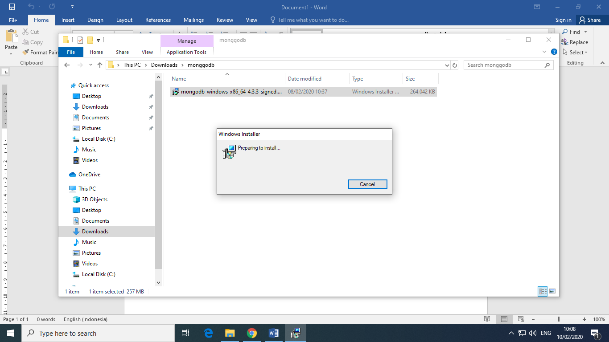
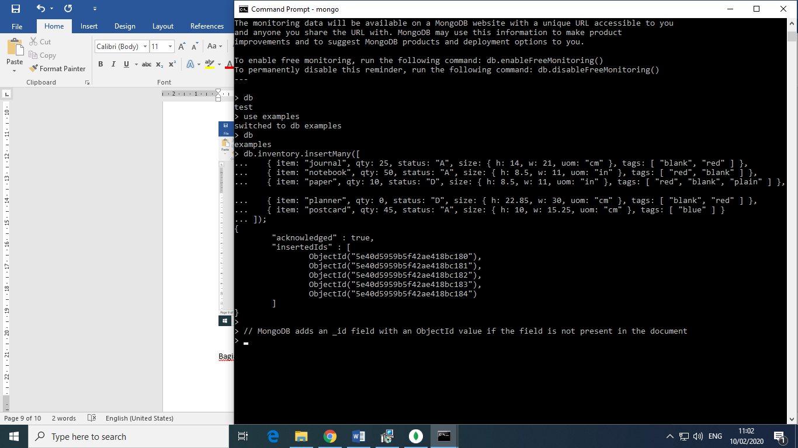
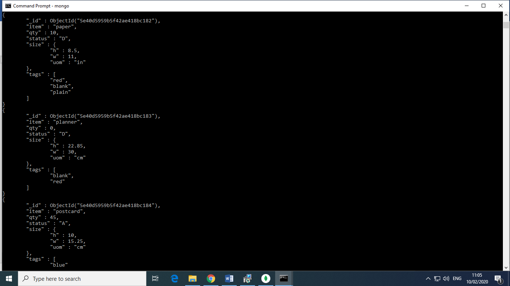
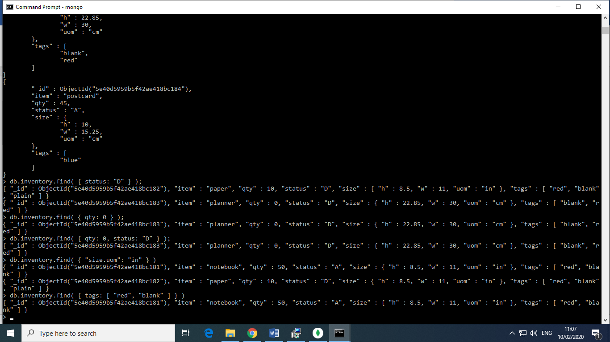
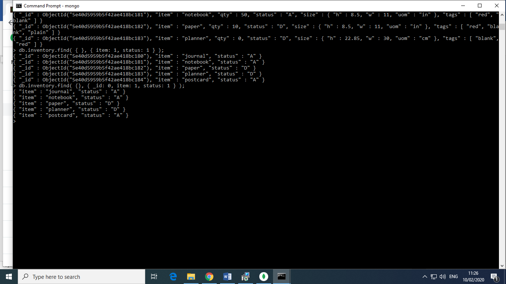
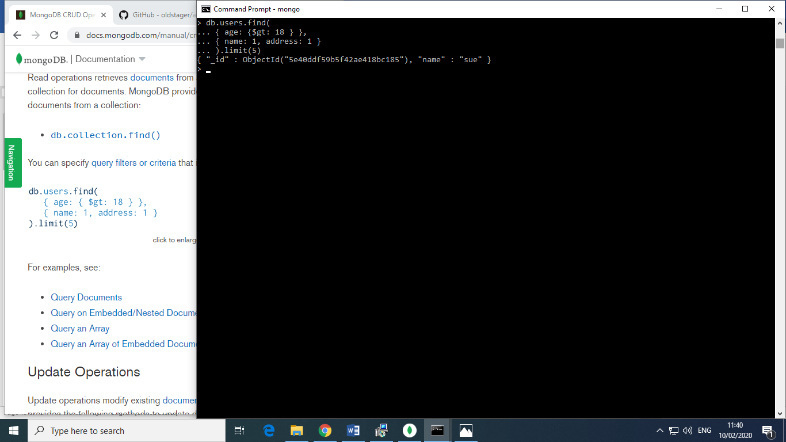

# tekn-basis-data
# latihan
# UAS

Pada praktikum pertemuan ke dua ini kita akan Install dan konfigurasi MongoDB server yang sudah anda download. ketika kita sudah habis mendownload maka akan muncul folder dan kita akan mengklik instal pada gambar 

# latihan no 3
Kerjakan Getting Started dari 0-4.
Di dalam shell, db merujuk ke database Anda saat ini. Ketik db untuk menampilkan basis data saat ini.Operasi harus mengembalikan tes, yang merupakan basis data default.

Untuk berpindah database, ketik gunakan <db>. Misalnya, untuk beralih ke database contoh: use examples
Anda tidak perlu membuat database sebelum beralih. MongoDB membuat database ketika Anda pertama kali menyimpan data dalam database itu (seperti membuat koleksi pertama dalam database).

Untuk memverifikasi bahwa database Anda sekarang adalah contoh, ketik db di shell di atas. Untuk membuat koleksi di database, lihat tab berikutnya. seperti pada 
MongoDB menyimpan dokumen dalam koleksi. Koleksi analog dengan tabel dalam database relasional. Jika koleksi tidak ada, MongoDB membuat koleksi ketika Anda pertama kali menyimpan data untuk koleksi itu.

Contoh berikut menggunakan metode db.collection.insertMany () untuk menyisipkan dokumen baru ke dalam koleksi inventaris. Anda dapat menyalin dan menempelkan contoh ke shell di atas. selanjutnya Untuk memilih dokumen dari koleksi, Anda dapat menggunakan metode db.collection.find (). Untuk memilih semua dokumen dalam koleksi, kirimkan dokumen kosong sebagai dokumen filter kueri ke metode.

Dalam shell, salin dan tempel yang berikut untuk mengembalikan semua dokumen dalam koleksi inventaris. selanjutnya Untuk memformat hasil, tambahkan .pretty () ke operasi find:

Contoh ini mengasumsikan bahwa Anda telah mengisi koleksi inventaris dari langkah sebelumnya seperti pada gambar  atau kecocokan kesetaraan (mis. <field> sama dengan <value>), tentukan <field>: <value> dalam dokumen filter kueri dan diteruskan ke metode db.collection.find ().

CATATAN

Contoh-contoh mengasumsikan bahwa Anda telah mengisi koleksi inventaris.

Dalam shell, salin dan tempel yang berikut ini untuk mengembalikan dokumen yang bidangnya sama dengan "D":

Dalam shell, salin dan tempel berikut ini untuk mengembalikan dokumen dengan bidang qty sama dengan 0:
Dalam shell, salin dan tempel berikut ini untuk mengembalikan dokumen dengan bidang qty sama dengan 0 dan bidang status sama dengan "D":

di shell, salin dan tempel berikut ini untuk mengembalikan dokumen tempat bidang uom, bersarang di dalam dokumen ukuran, sama dengan "in":

di shell, salin dan tempel yang berikut untuk mengembalikan dokumen tempat array tag berisi "merah" sebagai salah satu elemennya:

Jika bidang tag adalah string dan bukan array, maka kueri hanyalah kecocokan kesetaraan.
Dalam shell, salin dan rekatkan yang berikut untuk mengembalikan dokumen yang bidang tagnya cocok dengan array yang ditentukan, termasuk urutannya:   dan  

# latihan no 4

pada praktik nomor 4 ini kita memBuat Operasi
Buat atau masukkan operasi, tambahkan dokumen baru ke koleksi. Jika koleksi saat ini tidak ada, operasi memasukkan akan membuat koleksi.

MongoDB menyediakan metode berikut untuk memasukkan dokumen ke dalam koleksi:

db.collection.insertOne () Baru di versi 3.2
db.collection.insertMany () Baru dalam versi 3.2
Di MongoDB, masukkan target operasi satu koleksi. Semua operasi penulisan di MongoDB adalah atom pada tingkat satu dokumen seperti pada gambar Screenshot (22) , kemudian pada Operasi baca mengambil dokumen dari koleksi; mis. meminta koleksi untuk dokumen. MongoDB menyediakan metode berikut untuk membaca dokumen dari koleksi:

db.collection.find ()
Anda dapat menentukan filter kueri atau kriteria yang mengidentifikasi dokumen untuk dikembalikan seperti pada gambar  